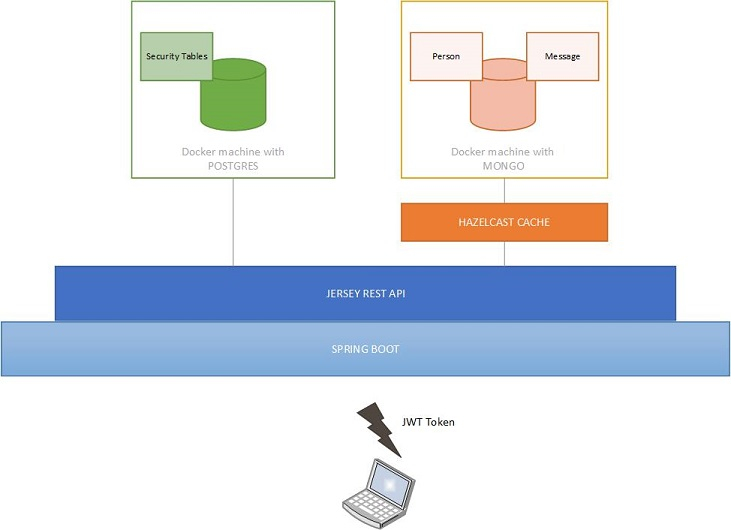

# queue-cache
Simple App with Hazelcast, MongoDb and Postgres under Spring Boot with Spring Data and Jersey

## **Steps to run the application:**
##### 1. Install mongoDb and Postgres. I used two docker machines:
      Postgres: 172.17.0.2:5432/postgres
      MongoDb: 172.17.0.3/admin 
      Check src/main/resources/application.properties for further information
##### 2. Modify the property "spring.datasource.initialize" to true in _application.properties_ 
      Necessary in order to deploy the schema and data of the security tables needed in Postgres.
##### 3. Run the application and put "spring.datasource.initialize" back to false for subsequent executions.

## Testing the Rest API:
##### 1. Hit http://localhost:9090/app/rest/login
      Use one of the valid credentials included on the table security.users in Postgres 
      in order the get a JWT Token on the header.
##### 2. You can now hit http://localhost:9090/app/rest/saveMessage 
      Supply a json and include the token in the header. Take a look to the integration tests provided. 
      Postman becomes quite useful to test the rest services. The rest of the url's can be found on the 
      controller folder.

## **Arquitecture:**

  

## **Useful information**
      1. The Hazelcast cache can be activated/deactivated using the Spring Boot profile called "cache" 
      (Check application.properties).
      2. Spring Data for Mongo and Spring Data JPA provide the repositories to access the Database. 
      A generic layer has been created in order to reuse code.
